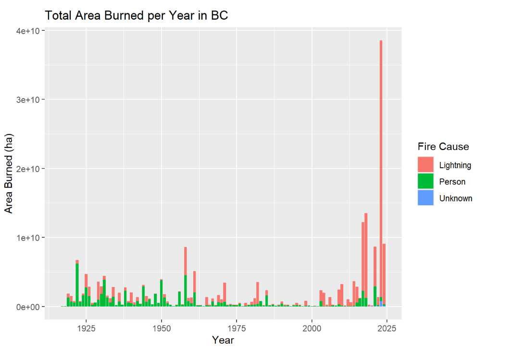
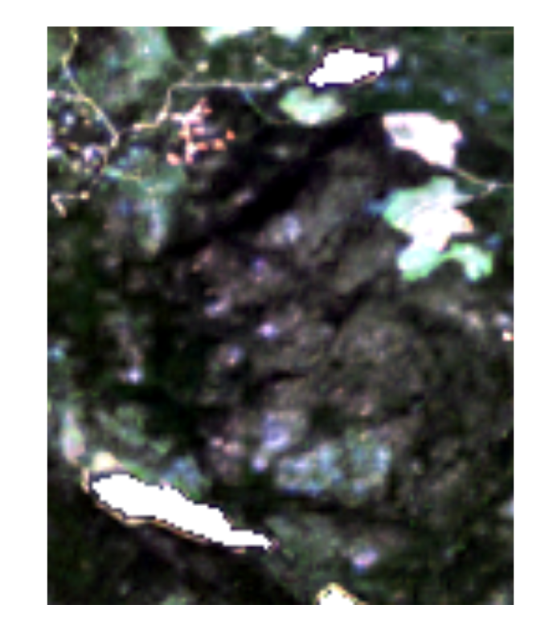
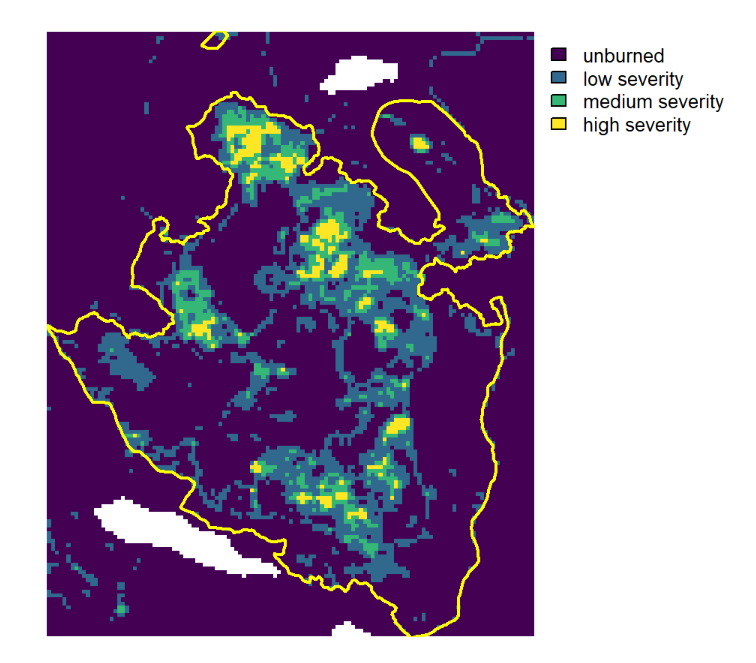
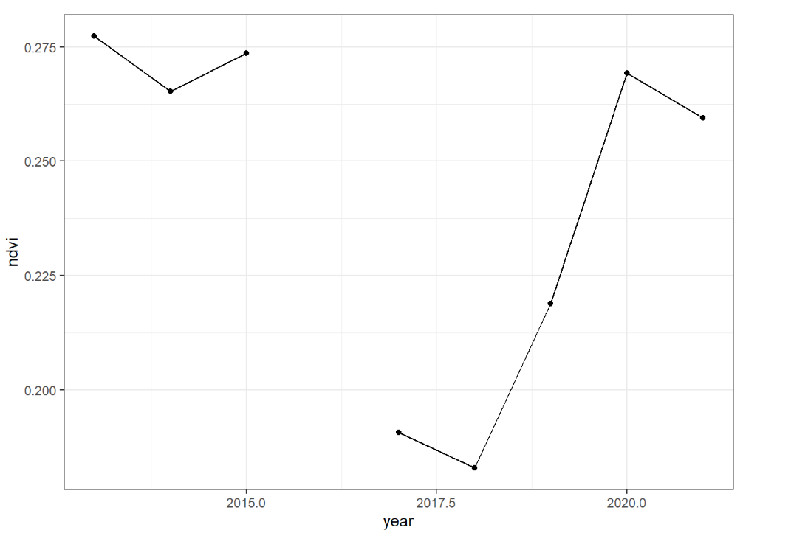
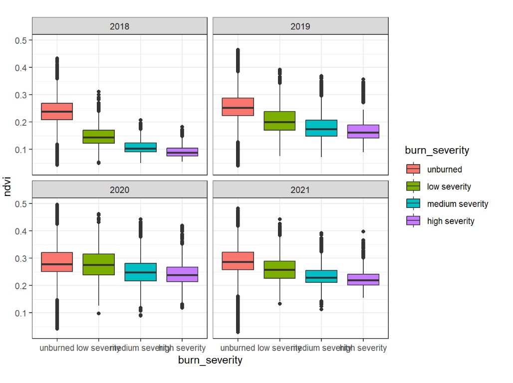

# Introduction

Summer 2017 was considered as one the worst wild fire season in BC (until 2023), with over 1.2 million ha of burned areas, 65,000 people displaced and \$649 million spent on fire suppression (<https://www2.gov.bc.ca/gov/content/safety/wildfire-status/about-bcws/wildfire-history/wildfire-season-summary>).

The Prouton Lakes fire (fire ID C30870) burned part of the Alex Fraser Research Forest (AFRF) located near Williams Lake, BC, on the traditional, ancestral and unceded territory of the T’exelcemc, Xatsu’ll and Esket First Nations. The burn severity varied from low-severity ground fire to high-severity canopy fire.

### Description of data

#### Landsat time-series

Landsat 8 Collection 2 Level-2 surface reflectance (SR) products are generated using the Land Surface Reflectance Code (LaSRC) algorithm that corrects for atmospheric effects at the time of the image acquisition. Unlike Level-1 products that represent top-of-atmosphere reflectance, Level-2 SR products therefore represent the fraction of incoming sunlight reflected by the Earth's surface (bottom-of-atmosphere) and can be combined and compared across time and space. Land surface temperature (ST) products are also generated in Landsat 8 Level-2 products. The surface reflectance and surface temperature products are accompanied by pixel-level quality assessment (QA) layers that indicate the presence of clouds, cloud shadows, snow/ice and water.

We focused on a single Landsat scene overlapping the study area (WRS Path 048; WRS Row 023) and downloaded all the Level-2 products acquired between the 1<sup>st</sup> of July and the 31<sup>st</sup> of August between 2013 and 2021 from the [USGS Earth Explorer](https://earthexplorer.usgs.gov/). This resulted in 35 products of approximately 1 GB each. Each product is named as described below.

##### Click to look at the code chunk

::: {.callout-note collapse="true"}

## Step 1 - Historical fires in BC


```{r, eval=FALSE}
#reading in the shapefile and then changing the area_sqm to hectares
fires <- st_read("C:/Users/pritty01.stu/Documents/GEM520- LAB/Lab8-Main Demonstration/lab8_final/lab8_finalDemonstrationOfRSkills-assign/data/PROT_HISTORICAL_FIRE_POLYS_SP/H_FIRE_PLY_polygon.shp")
   #mutate(fires$AREA_SQM <- as.numeric(st_area(fires)) / 10000)

#Filtering the fires to only 2017
fires_2017 <- fires %>% filter(FIRE_YEAR == 2017)

#Question1
fires_2017_summary <- fires_2017 %>%
  st_drop_geometry() %>%
  summarise(total_land_burned = sum(AREA_SQM, na.rm = TRUE), count= n())

#Question2
largest_fires_2017 <- fires_2017 %>%
  st_drop_geometry() %>%
  arrange(desc(AREA_SQM)) %>%
  slice(1:3)%>%
  select(FIRE_NO,FIRE_CAUSE,AREA_SQM)

#Question3
prouton_lakes <- fires_2017 %>%
  st_drop_geometry() %>%
  filter(FIRE_NO == "C30870") %>%
  select(FIRE_NO, AREA_SQM)

#ggplot for a bar plot to show total area burned per year in BC
ggplot(fires, aes(x = FIRE_YEAR, y = AREA_SQM, fill = FIRE_CAUSE)) +
  geom_col() +
  labs(
    title = "Total Area Burned per Year in BC",
    x = "Year",
    y = "Area Burned (ha)",
    fill = "Fire Cause"
  ) 
```

:::

#### Result 

{fig-align="center" width=50%}

##### Click to look at the code chunk

::: {.callout-note collapse="true"}

## Step 2 - Pre-processing Level-2 products and calculating vegetation indices


```{r, eval=FALSE}
# Directories
input_dir <- "C:/Users/pritty01.stu/Documents/GEM520- LAB/Lab8-Main Demonstration/lab8_final/lab8_finalDemonstrationOfRSkills-assign/data/Landsat 8 OLI_TIRS C2 L2"
output_dir_sr <- "C:/Users/pritty01.stu/Documents/GEM520- LAB/Lab8-Main Demonstration/lab8_final/lab8_finalDemonstrationOfRSkills-assign/output/LC08_L2SP_048023_SR"
output_dir_ndvi <- "C:/Users/pritty01.stu/Documents/GEM520- LAB/Lab8-Main Demonstration/lab8_final/lab8_finalDemonstrationOfRSkills-assign/output/LC08_L2SP_048023_NDVI"
output_dir_nbr <- "C:/Users/pritty01.stu/Documents/GEM520- LAB/Lab8-Main Demonstration/lab8_final/lab8_finalDemonstrationOfRSkills-assign/output/LC08_L2SP_048023_NBR"

# List product folders
flist <- list.dirs(input_dir, full.names = TRUE, recursive = FALSE)

# Read fire polygons
fires <- st_read("C:/Users/pritty01.stu/Documents/GEM520- LAB/Lab8-Main Demonstration/lab8_final/lab8_finalDemonstrationOfRSkills-assign/data/PROT_HISTORICAL_FIRE_POLYS_SP/H_FIRE_PLY_polygon.shp")

# Select Prouton Lakes (C30870)
prouton_lake <- fires %>% filter(FIRE_NO == "C30870")
prouton_lake_vect <- sf::st_transform(prouton_lake, crs = 32610)

sr_list <- list()
ndvi_list <- list()
nbr_list <- list()

for (m in 1:length(flist)) {

  flist_path <- flist[m]                 
  flist_name <- basename(flist_path)      

  # SR bands
  band_files <- list.files(
    flist_path,
    pattern = "SR_B[1-7].TIF$",
    full.names = TRUE
  )
  
  
  # QA_PIXEL
  qa_file <- list.files(
    flist_path,
    pattern = "QA_PIXEL.TIF$",
    full.names = TRUE
  )

  # Read rasters
  bands <- rast(band_files)
  names(bands) <- paste0("B", 1:7)

  qa <- rast(qa_file)

  # Mask clear pixels (QA = 21824)
  clear_mask <- qa == 21824
  sr_mask <- mask(bands, clear_mask, maskvalues = FALSE)

  # Crop to Prouton Lakes fire
  sr_crop <- crop(sr_mask, prouton_lake_vect)

  # NDVI and NBR
  NDVI <- (sr_crop$B5 - sr_crop$B4) / (sr_crop$B5 + sr_crop$B4)
  names(NDVI) <- "NDVI"

  NBR <- (sr_crop$B5 - sr_crop$B7) / (sr_crop$B5 + sr_crop$B7)
  names(NBR) <- "NBR"
  
  # storing the files to output 
  sr <- file.path(output_dir_sr, paste0(flist_name, "_SR.tif"))
  ndvi <- file.path(output_dir_ndvi, paste0(flist_name, "_NDVI.tif"))
  nbr <- file.path(output_dir_nbr, paste0(flist_name, "_NBR.tif"))
  
  #saving them to the disk
  writeRaster(sr_crop, sr, overwrite= TRUE)
  writeRaster(NDVI, ndvi, overwrite= TRUE)
  writeRaster(NBR, nbr, overwrite= TRUE)
}


#plotting the two images 
before_fire <- rast("C:/Users/pritty01.stu/Documents/GEM520- LAB/Lab8-Main Demonstration/lab8_final/lab8_finalDemonstrationOfRSkills-assign/output/LC08_L2SP_048023_SR/LC08_L2SP_048023_20150707_20200909_02_T1_SR.tif")
after_fire <- rast("C:/Users/pritty01.stu/Documents/GEM520- LAB/Lab8-Main Demonstration/lab8_final/lab8_finalDemonstrationOfRSkills-assign/output/LC08_L2SP_048023_SR/LC08_L2SP_048023_20180715_20200831_02_T1_SR.tif")

plotRGB(before_fire, r = "B4", g = "B3", b = "B2", stretch = "lin")

plotRGB(after_fire,  r = "B4", g = "B3", b = "B2", stretch = "lin")
    
```

:::

#### Result 

{fig-align="center" width=50%}

##### Click to look at the code chunk

::: {.callout-note collapse="true"}

# Step 3 - Yearly composites of NDVI and NBR


```{r, eval=FALSE}
nbr_flist <- list.files(
  "C:/Users/pritty01.stu/Documents/GEM520- LAB/Lab8-Main Demonstration/lab8_final/lab8_finalDemonstrationOfRSkills-assign/output/LC08_L2SP_048023_NBR",
  pattern = "tif$", full.names = TRUE
)

ndvi_flist <- list.files(
  "C:/Users/pritty01.stu/Documents/GEM520- LAB/Lab8-Main Demonstration/lab8_final/lab8_finalDemonstrationOfRSkills-assign/output/LC08_L2SP_048023_NDVI",
  pattern = "tif$", full.names = TRUE
)

ndvi_ts <- rast(ndvi_flist)
nbr_ts  <- rast(nbr_flist)


date_str <- str_extract(basename(ndvi_flist), "\\d{8}")
date_ts  <- ymd(date_str)

years  <- year(date_ts)
months <- month(date_ts)

unique_years <- sort(unique(years))

prouton_lake <- fires %>% filter(FIRE_NO == "C30870")
prouton_lake_vect <- vect(prouton_lake)   # convert to SpatVector
prouton_lake_vect <- project(prouton_lake_vect, ndvi_ts)

ndvi_yearly_list <- list()
nbr_yearly_list  <- list()

#loop through each year
for (i in 1:length(unique_years)) {
    
    yr <- unique_years[i]
    
    #Filter for July or August of this year
    trg_layers <- which(year(date_ts) == yr & month(date_ts) %in% c(7,8))
    
    # Subset rasters
    ndvi_subset <- subset(ndvi_ts, trg_layers)
    nbr_subset  <- subset(nbr_ts,  trg_layers)
    
    # Compute yearly composite (mean)
    ndvi_avg <- app(ndvi_subset, fun = mean, na.rm = TRUE)
    nbr_avg  <- app(nbr_subset,  fun = mean, na.rm = TRUE)
    
    # Name layers with the year
    names(ndvi_avg) <- as.character(yr)
    names(nbr_avg)  <- as.character(yr)
    
    # Store
    ndvi_yearly_list[[i]] <- ndvi_avg
    nbr_yearly_list[[i]]  <- nbr_avg
}


ndvi_yearly <- rast(ndvi_yearly_list)
nbr_yearly  <- rast(nbr_yearly_list)

ndvi_mean <- terra::extract(ndvi_yearly, prouton_lake_vect, fun = mean, na.rm = TRUE)

ndvi_long <- ndvi_mean %>%
  select(-ID) %>%
  pivot_longer(
    cols = everything(),
    names_to = "year",
    values_to = "ndvi"
  ) %>%
  mutate(year = as.numeric(year))

#ndvi_roi_summary <- ndvi_long %>%
 # group_by(year) %>%
  #summarise(ndvi_mean = mean(ndvi, na.rm = TRUE)) %>%
  #arrange(desc(ndvi_mean))

ggplot(ndvi_long, aes(x = year, y = ndvi)) +
geom_point() +
geom_line() +
theme_bw()
```

:::

#### Results 

{fig-align="center" width=50%}


##### Click to look at the code chunk

::: {.callout-note collapse="true"}


# Step 4 - Classify burn severity


```{r, eval=FALSE}
#getting the rasters that are pre and post
pre_fire <- nbr_yearly$`2015`
post_fire <- nbr_yearly$`2018`

#cropping to prouton lake extends
pre_fire_crop <- crop(pre_fire, prouton_lake_vect)
post_fire_crop <- crop(post_fire, prouton_lake_vect)

#calculating the dNBR
dNBR <- pre_fire_crop - post_fire_crop

#reclassify
reclassify <- matrix(c(
  -0.2, 0.15, 1, 
  0.15, 0.25, 2, 
  0.25, 0.3, 3, 
  0.3, 1, 4),byrow = TRUE, ncol = 3)

burn <- classify(dNBR, reclassify)

#givng claases  
levels(burn) <- data.frame(id = c(1,2,3,4),
label = c("unburned","low severity","medium severity","high severity"))

#plotting the map
plot(burn, axes = FALSE, legend = TRUE)
#overlaying the boundary
plot(prouton_lake_vect, add = TRUE, border = "yellow", lwd = 2)
```

:::

#### Results 

{fig-align="center" width=50%}

##### Click to look at the code chunk

::: {.callout-note collapse="true"}

# Step 5 - Post-fire vegetation recovery


```{r, eval=FALSE}
#converting burn severity nbr to polygons
burn_poly <- terra::as.polygons(burn, dissolve = TRUE)

#extracting them individually in regards to the burn severity 
ndvi_2018 <- terra::extract(ndvi_yearly[["2018"]], burn_poly)
ndvi_2019 <- terra::extract(ndvi_yearly[["2019"]], burn_poly)
ndvi_2020 <- terra::extract(ndvi_yearly[["2020"]], burn_poly)
ndvi_2021 <- terra::extract(ndvi_yearly[["2021"]], burn_poly)


#long format to add the column burn severity ~ 2018
ndvi_long_2018 <- ndvi_2018 %>%
  pivot_longer(cols = -ID, values_to = "ndvi") %>%
  mutate(
    burn_severity = factor(ID, 
                           levels = c(1,2,3,4),
                           labels = c("unburned",
                                      "low severity",
                                      "medium severity",
                                      "high severity")
  ))


#plot them separately for each year
plot(ndvi_yearly[["2018"]], main = "2018", range = c(0,0.5))

#long format to add the column burn severity ~ 2019
ndvi_long_2019 <- ndvi_2019 %>%
  pivot_longer(cols = -ID, values_to = "ndvi") %>%
  mutate(
    burn_severity = factor(ID, 
                           levels = c(1,2,3,4),
                           labels = c("unburned",
                                      "low severity",
                                      "medium severity",
                                      "high severity")
  ))


#plot them separately for each year
plot(ndvi_yearly[["2019"]], main = "2019", range = c(0,0.5))

#long format to add the column burn severity ~ 2020
ndvi_long_2020 <- ndvi_2020 %>%
  pivot_longer(cols = -ID, values_to = "ndvi") %>%
  mutate(
    burn_severity = factor(ID, 
                           levels = c(1,2,3,4),
                           labels = c("unburned",
                                      "low severity",
                                      "medium severity",
                                      "high severity")
  ))

#plot them separately for each year
plot(ndvi_yearly[["2020"]], main = "2020", range = c(0,0.5))

#long format to add the column burn severity ~ 2021
ndvi_long_2021 <- ndvi_2021 %>%
  pivot_longer(cols = -ID, values_to = "ndvi") %>%
  mutate(
    burn_severity = factor(ID, 
                           levels = c(1,2,3,4),
                           labels = c("unburned",
                                      "low severity",
                                      "medium severity",
                                      "high severity")
  ))

#plot them separately for each year
plot(ndvi_yearly[["2021"]], main = "2021", range = c(0,0.5))


#individually 
ndvi_long_2018$year <- "2018"
ndvi_long_2019$year <- "2019"
ndvi_long_2020$year <- "2020"
ndvi_long_2021$year <- "2021"

ndvi_all <- rbind(ndvi_long_2018,
                  ndvi_long_2019,
                  ndvi_long_2020,
                  ndvi_long_2021)

ggplot(ndvi_all, aes(x = burn_severity, y = ndvi, fill = burn_severity)) +
  geom_boxplot() +
  facet_wrap(~year, ncol = 2) +
  theme_bw()
```

:::

#### Result 

{fig-align="center" width=50%}


