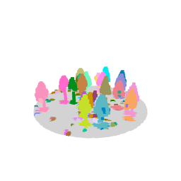
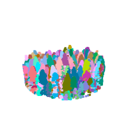
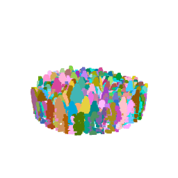
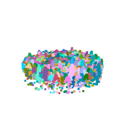

Individual tree segmentation plays an important role in modern forest analysis by enabling tree-level assessments across large landscapes. Using airborne LiDAR data, trees can be identified and analyzed individually, allowing researchers to estimate structural characteristics such as biomass, canopy structure, and carbon storage more efficiently than traditional field-based measurements. These methods improve the speed and accuracy of forest monitoring and support better decision-making for sustainable forest management.

In this study, the **lidR** package in R was used to compare two segmentation approaches across four sample plots located in the Malcolm Knapp Research Forest in British Columbia. Prior to segmentation, the LiDAR point cloud data were preprocessed through normalization and filtering procedures. A Digital Elevation Model (DEM) derived from the point cloud was used to normalize tree heights, ensuring that segmentation results represented accurate above-ground structure.

## 1. Individual Tree segmentation done with Li2012

```{r, eval=FALSE}
#Plot1
las1 <- readLAS("Plots/MKRF_Plot_1.las")
#using li2012 segmentation method
las_1 <- segment_trees(las1, li2012(dt1 = 1.5, dt2 = 2, R= 2, Zu = 15, speed_up = 10))
plot(las_1, color = "treeID")

#Plot2
las2 <- readLAS("Plots/MKRF_Plot_2.las")
#using li2012 segmentation method
las_2 <- segment_trees(las2, li2012(dt1 = 1.5, dt2 = 2, R= 2, Zu = 15, speed_up = 10))
plot(las_2, color = "treeID")

#Plot3
las3 <- readLAS("Plots/MKRF_Plot_3.las")
#using li2012 segmentation method
las_3 <- segment_trees(las3, li2012(dt1 = 1.5, dt2 = 2, R= 2, Zu = 15, speed_up = 10))
plot(las_3, color = "treeID")

#Plot4
las4 <- readLAS("Plots/MKRF_Plot_4.las")
#using li2012 segmentation method
las_4 <- segment_trees(las4, li2012(dt1 = 1.5, dt2 = 2, R= 2, Zu = 15, speed_up = 10))
plot(las_4, color = "treeID")
```


::: {.columns}

::: {.column width="50%"}


### Plot 1

:::

::: {.column width="50%"}

### Plot 2


:::

::: {.column width="50%"}

### Plot 3


:::

::: {.column width="50%"}

### Plot 4

:::

## 2. Individual Tree segmentation done with Dalponte2016


```{r, eval=FALSE}
#reading in the LAS files 
las2 <- readLAS("Plots/MKRF_Plot_2.las")


#creating the CHM-- doing different spatial resolutions
chm_0.5 <- rasterize_canopy(las2, 0.5, pitfree())
plot(chm_0.5, main = "0.5 Resolution")

#resolution 2
chm2 <- rasterize_canopy(las2, 2, pitfree())
plot(chm2, main = "2 Resolution")

#resolution 4
chm4 <- rasterize_canopy(las2, 4, pitfree())
plot(chm4, main = "4 Resolution")

#resolution 10
chm_10 <- rasterize_canopy(las2, 10, pitfree())
plot(chm_10, main = "10 Resolution")


#Output segmentation of Plot 2 with 2m resolution using dalponte2016.
ttops <- locate_trees(chm2, lmf(4, 2))
las2   <- segment_trees(las2, dalponte2016(chm2, ttops, th_tree = 2,
  th_seed = 0.45,
  th_cr = 0.55,
  max_cr = 10,
  ID = "treeID"))
plot(las2, color = "treeID")
```


::: {.columns}

::: {.column width="50%"}


### Plot 1

:::

::: {.column width="50%"}

### Plot 2


:::

::: {.column width="50%"}

### Plot 3


:::

::: {.column width="50%"}

### Plot 4

:::


