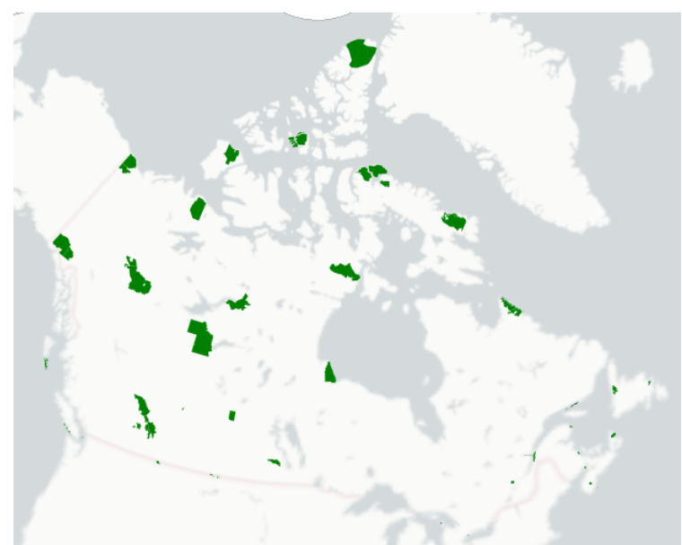
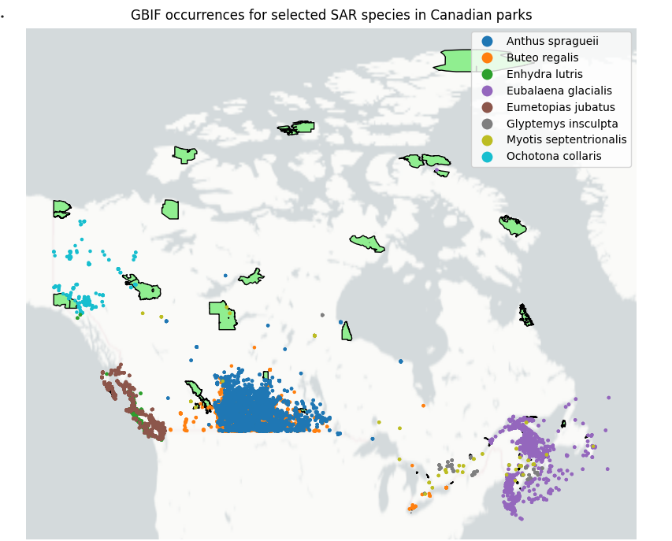
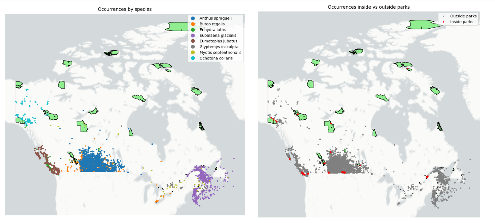
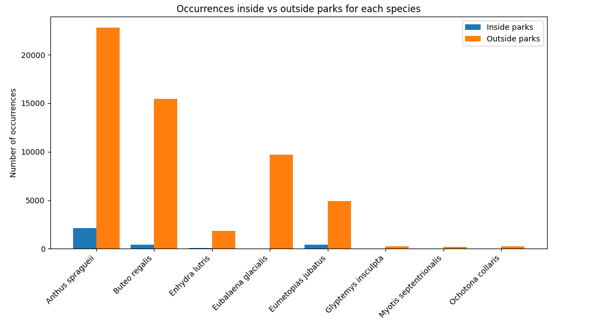

## 1. Background & Motivation

The conservation status of at-risk plants and animals is determined by several international, national, and provincial organizations. To provide a more consistent way of evaluating the conservation risk facing wildlife species and their habitats, The Nature Conservancy partnered with the Natural Heritage Network to create NatureServe in July 1999. This organization developed a standardized ranking system to assess species’ levels of threat and vulnerability (Proulx, 2003)

In recent years, the availability of biodiversity data has expanded rapidly through platforms such as GBIF (Global Biodiversity Information Facility), which aggregates observations from citizen science projects (eg., iNaturalist, eBird), museum records, long term ecological monitoring, and scientific research.

The issues that we are directly addressing in this project is by combining legally designated SAR list from the Species at Risk Act(SARA), National park boundaries, and GBIF occurence data. We tried creating a reproducible geospatial workflow that would help us identify SAR occurences inside Canadian National Parks.

 - we narrowed down our list to about 10 species that are endangered across Canadian National Parks

 - whether those species are currently being protected by park

 - and which species among them are underrepresented by parks.

Our goal is to develop a fully automated dashboard for Parks Canada that compiles all legally designated endangered species and dynamically filters them to highlight the top five most frequently observed species based on user-defined criteria. This tool will allow users to select a specific National Park and instantly view the species with the highest occurrence records, supporting more informed conservation and management decisions.

Pictures of the Species we looked at - I only included the ones that are cute.


## 2. Objectives

To determine the occurrence of species at risk in Canadian, we will:

  1. Visualize the occurrence of species at risk in Canada, as they relate to National parks.
  2. Analyze the quantity of species at risk occurring within parks boundaries compared to beyond parks      boundaries.
  3. Produce two side-by-side maps which demonstrate the occurrences for specific species within parks,      and how those species are also observed beyond parks, to evaluate the role that parks are palying      in protecting our species at risk.
  
## 1. Visualize the occurrence of species at risk in Canada, as they relate to National parks.

#### Cleaning and getting the data ready

```{r, eval=FALSE}
# If packages are not installed, use the line below.
%pip install rasterio geopandas contextily pygbif

# Import packages
import rasterio
import geopandas as gpd
import contextily as cx
from pygbif import species, occurrences
import pandas as pd
import numpy as np
import matplotlib.pyplot as plt

# To import the datasets, run the code below and select these saved files:
# 'CAN-SAR_database.csv'
# 'parks.gpkg'
from google.colab import files
files.upload()

# Open the data containing the legal boundaries for all of the parks.
parks_gdf = gpd.read_file(r"parks.gpkg")

print(parks_gdf.head(5))

print(parks_gdf.crs)

# This map helps visualize the existing National parks of Canada.
ax = parks_gdf.plot(figsize=(8, 8), facecolor='green')
cx.add_basemap(ax, crs=parks_gdf.crs,
               source=cx.providers.CartoDB.PositronNoLabels,
               attribution="")
ax.set_axis_off()
```


 
## Creating a list of species from the SAR database, calling them into a list  


```{r, eval=FALSE}
# Create a list of species, from the SAR database, that is small enough to run
# without delay using the GBIF API.
SAR_db = pd.read_csv('CAN-SAR_database.csv')
print(SAR_db.head(5))

common_names = ["collared pika",
                "northern myotis",
                "sea otter",
                "steller sea lion",
                "bicknell's thursh"
                "grizzly bear western population",
                "ferruginous hawk",
                "north atlantic right whale",
                "sprague's pipit",
                "wood turtle"
                ]

# Filter the DataFrame by common name
filtered_SAR_db = SAR_db[SAR_db['common_name'].isin(common_names)]

# Keep only the relevant columns: common name and Latin species name
filtered_SAR_db = filtered_SAR_db[['common_name', 'species']]

# Look at the list to make sure you can see your subset of species
print(filtered_SAR_db)

# Save this list
filtered_SAR_db.to_csv('filtered_SAR_list.csv', index=False)
species_list = filtered_SAR_db['species'].tolist()

## 2. The two lists we will work with are a modified list of species at risk,
# and parks polygons.

filtered_SAR_db = pd.read_csv('filtered_SAR_list.csv')
species_list = filtered_SAR_db['species'].tolist()

parks_gdf = gpd.read_file(r"parks.gpkg")
parks_gdf = parks_gdf.to_crs('EPSG:4326')
# Tutorials for reading & writing spatial data with geopandas are included
# in our references.

# Checking all labels name in GBIF records
from pygbif import occurrences

# Make a simple GBIF request (one page only)
out = occurrences.search(
    scientificName="Ursus maritimus",   # polar bear
    country="CA",
    hasCoordinate=True
)

# Take the first record from the "results"
sample = out['results'][0]

# Print ALL field names
print(sample.keys())

# Print the entire record (to see values)
print(sample)

```

## 2.Analyze the quantity of species at risk occurring within parks boundaries compared to beyond parks     boundaries.

#### Creating a function that can download the data whenever needed from SAR database for the species we decided 

```{r, eval=FALSE}
def get_occurrences_for_species(scientific_name):
    """
    Ask GBIF for all occurrences of one species in Canada,
    return them as a GeoDataFrame of points in the same CRS as parks_gdf.
    If no records found, return None.
    """
    results = []
    offset = 0

    while True:
        out = occurrences.search(
            scientificName=scientific_name,
            country='CA',
            hasCoordinate=True,
            hasGeospatialIssue=False,
            offset=offset
        )

        this_page = out['results']

        if len(this_page) == 0:
            break

        results.extend(this_page)
        offset += len(this_page)

    if len(results) == 0:
        print(f"No GBIF records for {scientific_name}")
        return None

    # Extract coordinates + common names
    lat_ls = []
    lon_ls = []
    common_ls = []

    for r in results:
        lat = r.get('decimalLatitude')
        lon = r.get('decimalLongitude')

        if lat is not None and lon is not None:
            lat_ls.append(lat)
            lon_ls.append(lon)
            common_ls.append(r.get('vernacularName', "Unknown"))

    if len(lat_ls) == 0:
        print(f"No valid coordinates for {scientific_name}")
        return None

    # Build GeoDataFrame
    gdf = gpd.GeoDataFrame(
        {
            "species": scientific_name,
            "common_name": common_ls,
            "geometry": gpd.points_from_xy(lon_ls, lat_ls)
        },
        crs='EPSG:4326'
    ).to_crs(parks_gdf.crs)

    return gdf
    
# Downloading the occurances for six species, inside and outside of parks
all_gdfs = []

for sp in species_list:
    print(f"\nDownloading GBIF records for: {sp}")
    gdf = get_occurrences_for_species(sp)
    if gdf is not None:
        all_gdfs.append(gdf)

# If we got at least one species with data, combine them
if len(all_gdfs) == 0:
    raise ValueError("No GBIF data found for any species in the list.")

combined_gdf = pd.concat(all_gdfs, ignore_index=True)

print("\nCombined GeoDataFrame:")
print(combined_gdf.head())

# Make a base plot of parks
fig, ax = plt.subplots(figsize=(10, 10))
parks_gdf.plot(ax=ax, facecolor='lightgreen', edgecolor='black')

# Plot all species points, colored by species
combined_gdf.plot(
    ax=ax,
    column='species',      # color by species
    categorical=True,
    legend=True,
    markersize=5
)

# Add a basemap behind
cx.add_basemap(
    ax,
    crs=parks_gdf.crs,
    source=cx.providers.CartoDB.PositronNoLabels,
    attribution=""
)

ax.set_axis_off()
plt.title("GBIF occurrences for selected SAR species in Canadian parks")
plt.show()
```


## Visual representation of selected SAR species in Canadian Parks


 
## 3. Produce two side-by-side maps which demonstrate the occurrences for specific species within parks,and how those species are also observed beyond parks, to evaluate the role that parks are palying in protecting our species at risk.


#### Doing a spatial join to see if the points match the park - inside or outside 

```{r, eval=FALSE}
# Spatial join: each point gets matched to a park (if any)
joined = gpd.sjoin(
    combined_gdf,
    parks_gdf[['geometry']],   # we only need geometry for overlay
    how='left',
    predicate='intersects'
)

# Create a flag: True = inside a park, False = outside
joined['inside_park'] = ~joined['index_right'].isna()

# Optional: keep only needed columns
occ_gdf = joined[['geometry', 'species', 'inside_park']].copy()

# For more info on the geopandas sjoin function, see references.
# The sjoin executes an overlay operation resulting in new geometry.

# Split points into inside vs outside
inside = occ_gdf[occ_gdf['inside_park']]
outside = occ_gdf[~occ_gdf['inside_park']]

# Create subplots: 1 row, 2 columns
fig, (ax1, ax2) = plt.subplots(1, 2, figsize=(18, 8))

# LEFT MAP: species-level map
parks_gdf.plot(ax=ax1, facecolor='lightgreen', edgecolor='black')
occ_gdf.plot(
    ax=ax1,
    column='species',     # color by species
    categorical=True,
    legend=True,
    markersize=5
)
cx.add_basemap(
    ax1,
    crs=parks_gdf.crs,
    source=cx.providers.CartoDB.PositronNoLabels,
    attribution=""
)
ax1.set_axis_off()
ax1.set_title("Occurrences by species")


# RIGHT MAP: inside vs outside parks
parks_gdf.plot(ax=ax2, facecolor='lightgreen', edgecolor='black')

# Outside points
outside.plot(ax=ax2, color='grey', markersize=5, label='Outside parks', alpha=0.6)

# Inside points
inside.plot(ax=ax2, color='red', markersize=8, label='Inside parks')

cx.add_basemap(
    ax2,
    crs=parks_gdf.crs,
    source=cx.providers.CartoDB.PositronNoLabels,
    attribution=""
)
ax2.set_axis_off()
ax2.set_title("Occurrences inside vs outside parks")

# Add a legend for inside/outside
ax2.legend()

plt.tight_layout()
plt.show()
```

#### Visual representation of code 

 

### Summary table to show how species are under represented by parks 

```{r, eval=FALSE}
# Total number of occurrences per species
species_counts = (
    occ_gdf
    .groupby('species')
    .size()
    .reset_index(name='n_occurrences')
    .sort_values('n_occurrences', ascending=False)
)

print("Number of occurrences per species:")
print(species_counts)

# Group by species and inside_park flag
inside_outside_counts = (
    occ_gdf
    .groupby(['species', 'inside_park'])
    .size()
    .unstack(fill_value=0)   # columns: False, True
    .rename(columns={True: 'inside_parks', False: 'outside_parks'})
    .reset_index()
)

print("Occurrences inside vs outside parks, per species:")
print(inside_outside_counts)

# Use the summary table from above
df = inside_outside_counts.copy()

# X locations for each species
x = np.arange(len(df))   # 0, 1, 2, ...

width = 0.4  # width of each bar

fig, ax = plt.subplots(figsize=(10, 6))

# Bars for inside parks (shifted left)
ax.bar(x - width/2, df['inside_parks'], width, label='Inside parks')

# Bars for outside parks (shifted right)
ax.bar(x + width/2, df['outside_parks'], width, label='Outside parks')

# X-axis: species names
ax.set_xticks(x)
ax.set_xticklabels(df['species'], rotation=45, ha='right')

ax.set_ylabel('Number of occurrences')
ax.set_title('Occurrences inside vs outside parks for each species')
ax.legend()

plt.tight_layout()
plt.show()
```


#### Graph showing the representation 

 
