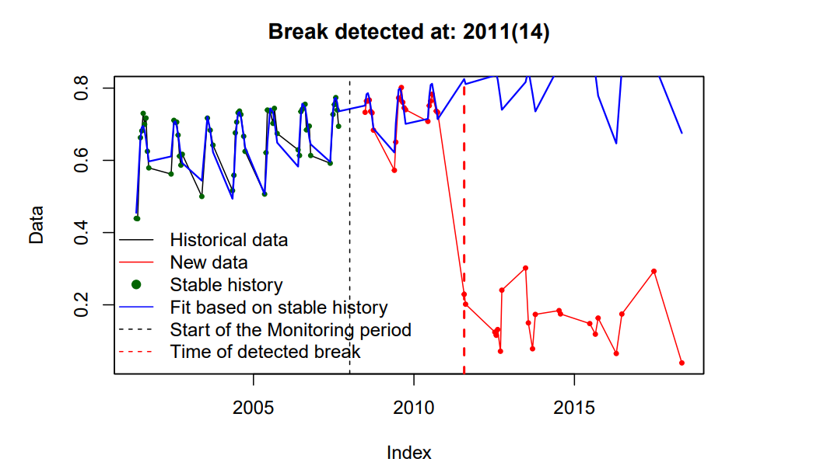
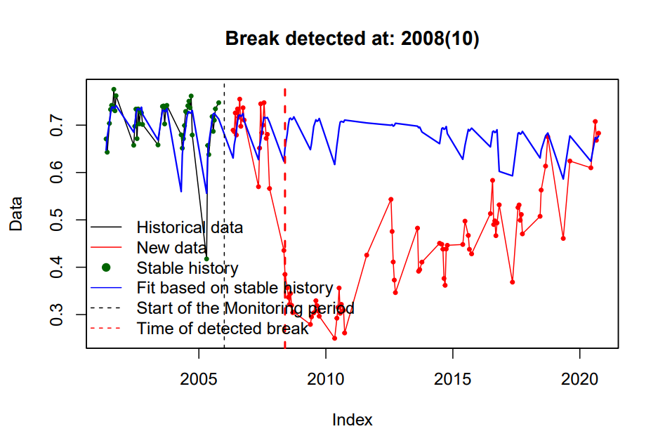
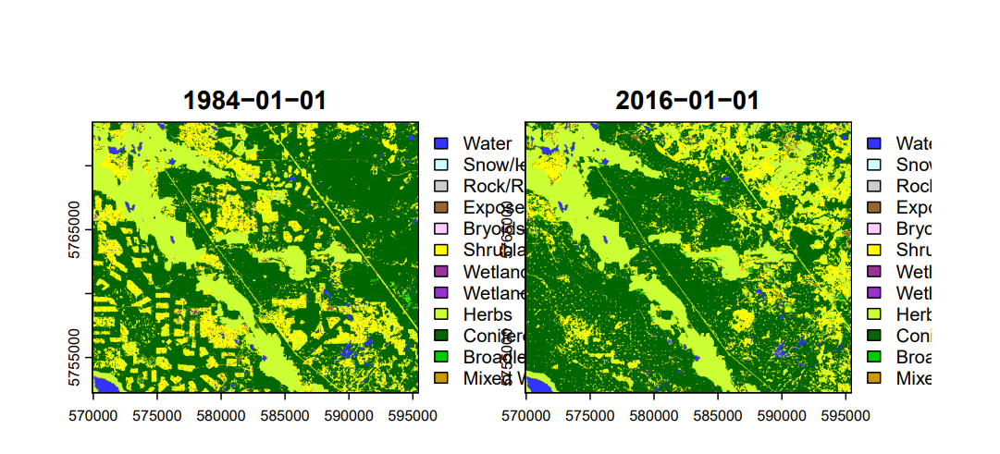
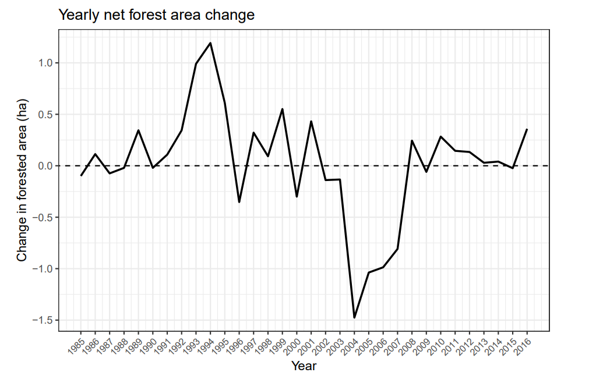
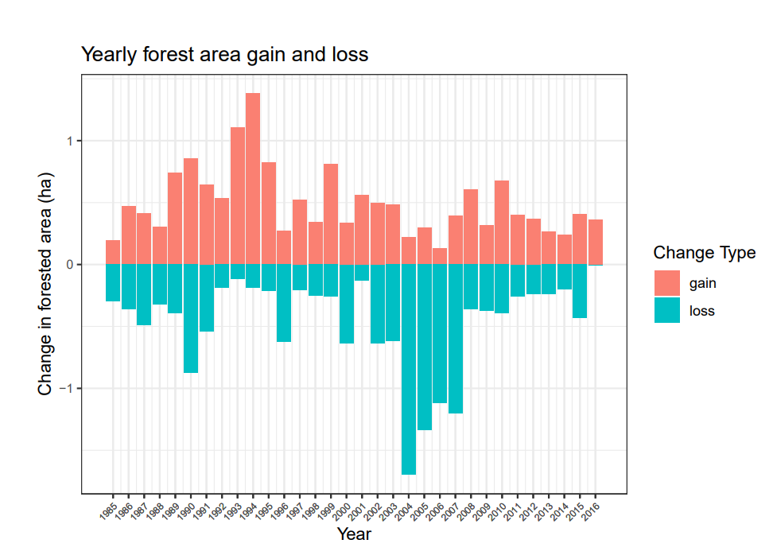

Time-series analysis helps reveal how environmental conditions change over time by identifying patterns and disturbances in historical data.

## Part 1 - MODIS NDVI time-series analysis

In this project, NDVI time-series analysis was conducted for Yellowhead County, Alberta using MODIS MOD13Q1 imagery from 2001–2020. The BFAST change detection algorithm was applied to identify breaks in the NDVI signal across two areas of interest. By examining vegetation response following each detected break, the analysis provided insight into potential disturbance events and vegetation recovery patterns.

### Process MODIS Imagery and plotting BFAST graphs

```{r, eval=FALSE}
#listing all the ndvi
ndvi_ts <- rast(flist)
names(ndvi_ts) <- date_ts

#mean calculated
ndvi_ts_med <- app(ndvi_ts, fun = median, na.rm = TRUE)

#plotted to show how it looks
plot(ndvi_ts_med,
main = "Median NDVI",
col = terrain.colors(40))

#calling in the shapefile
roi <- vect("data/roi_MOD13Q1.shp")

#checking their crs
crs(roi)

#extracting ndvi's mean here
ndvi_roi <- terra::extract(ndvi_ts, roi,fun= mean, na.rm = TRUE)

#pivoted the table to long and then mutated the columns to look filter it out
ndvi_roi_long <- pivot_longer(ndvi_roi, cols = 2:ncol(ndvi_roi), names_to = "date", values_to = "ndvi") %>%
mutate(date= as.Date(date),year= year(date),month= month(date, label = TRUE),month_digit= month(date))
head(ndvi_roi)

#filter to get the years and months
ndvi_roi_filter <- ndvi_roi_long %>% filter (month_digit >= 5 & month_digit <= 9, year <= 2006)
#summarized it and grouped it by month to know the month with the highest average
ndvi_roi_summary <- ndvi_roi_filter %>% group_by(month) %>% summarise(ndvi_mean = mean(ndvi, na.rm= TRUE))

#ggplot for summarisation
ggplot(ndvi_roi_summary, aes(x = month, y = ndvi_mean, group = 1)) +
geom_point() +
geom_line() +
theme_bw()

#filtering out the roi's
ndvi_roi_A <- ndvi_roi_long %>% filter(ID== 1) %>% select ("ndvi")
ndvi_roi_B <- ndvi_roi_long %>% filter(ID== 2) %>% select ("ndvi")
#creating separate data frames
ndvi_roi_A <- ts(ndvi_roi_A,
frequency = 23,
start = c(2001, 1))
ndvi_roi_B <- ts(ndvi_roi_B,
frequency = 23,
start = c(2001, 1))
#bfast monitoring graphs
bfm1 <- bfast::bfastmonitor(ndvi_roi_A,
start = c(2008,1))
bfm2 <- bfast::bfastmonitor(ndvi_roi_B,
start = c(2006,1))
#plotting the graphs
plot(bfm1)
                                                                      
```

::: {.columns}

::: {.column width="50%"}

{width=100%}

{width=100%}

:::

::: {.column width="50%" style="padding-left:40px;"}

#### Break detected at 2011

Time series showing a detected break in the spectral index at 2011 (14). Historical stable observations (black/green) were used to model the expected trend (blue). The monitoring period begins at the black dashed line, and the disturbance is marked by the red dashed line, after which observed values (red) deviate from the stable trend.

---

#### Break detected at 2008

Time series showing a detected break in the spectral index at 2008 (10). Stable historical observations (black/green) were used to model the expected trend (blue). The monitoring period begins at the black dashed line, and the disturbance is indicated by the red dashed line, where observed values (red) diverge from the predicted stable trend.

:::

:::

## Part 2 -  Land cover time series analysis

### Process imagery 

```{r, eval=FALSE}
#list of all the vlce files
flist_vlce <- list.files("data/VLCE_TS",
pattern = "tif$",
full.names = TRUE)

#just extracting the ones that come with these filter
fyear <- str_sub(flist_vlce, start = 38, end = 41)
fyear

#filtering them
year_ts <- lubridate::as_date(fyear, format = "%Y")

#listing them in one spatraster
vlce_ts <- rast(flist_vlce)

#putting them into a new dataframe
names(vlce_ts) <- year_ts

#ploted the raster to see side by side
plot(subset(trg_vlce, 1:33))
```


#### Visual results of how the vegetation changed 

{width=100%}

## Visual representation of Forest Area change 

```{r, eval=FALSE}
#1
ggplot(forest_change, aes(x = year, y = net_change)) +
  geom_line(color = "black", size = 0.8) +
  geom_abline(slope = 0, intercept = 0,
              linetype = "dashed", color = "black") +
  scale_x_continuous(
    breaks = forest_change$year,
    labels = forest_change$year
) +
labs(
  title = "Yearly net forest area change",
  x = "Year",
  y = "Change in forested area (ha)"
) +
theme_bw() +
theme(
  axis.text.x = element_text(angle = 45, hjust = 1, size = 8)
)

#2

ggplot_change <- forest_change %>% mutate(loss = -loss) %>%
  pivot_longer(cols = c(gain,loss), names_to = "type",values_to = "change")
ggplot(ggplot_change, aes(x = year, y = change, fill = type)) +
  geom_col() +
  scale_fill_manual(
    name = "Change Type",
    values = c("gain" = "salmon", # salmon
               "loss" = "#00BFC4") # teal
) +
scale_x_continuous(
  breaks = ggplot_change$year,
  labels = ggplot_change$year
) +
labs(
  title = "Yearly forest area gain and loss",
  x = "Year",
  y = "Change in forested area (ha)"
) +
theme_bw() +
theme(axis.text.x = element_text(angle = 45, hjust = 1, size = 6), axis.text.y = element_text(size =2)) 
```


::: {.columns}

::: {.column width="50%"}

{width=100%}

<br>

{width=100%}

:::

::: {.column width="50%" style="padding-left:40px;"}

#### Net Forest Area Change

This figure illustrates the net annual change in forest area between 1985 and 2016. Positive values indicate years where forest gains exceeded losses, while negative values represent years where forest loss dominated.

The largest decline occurred around 2004, indicating a period of substantial forest disturbance.

---

#### Forest Area Gain and Loss

This figure separates annual forest gains and losses to better illustrate the dynamics behind the net change. Forest gains (red bars) represent areas of vegetation recovery or regrowth, while losses (blue bars) indicate deforestation or disturbance.

A notable spike in forest loss occurred in the mid-2000s, corresponding with the sharp net decline observed in the previous figure.

:::

:::


