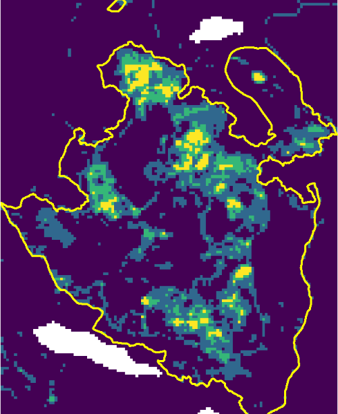
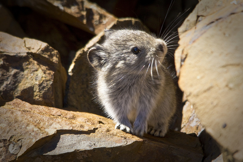
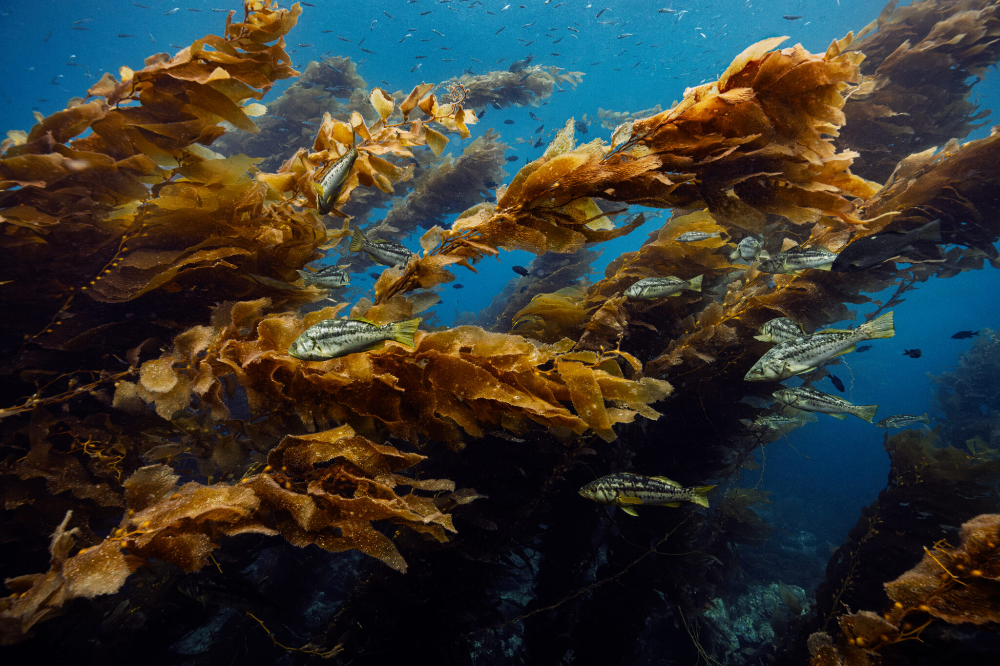
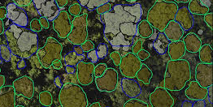
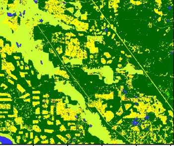

::: {.columns}

::: {.column width="50%"}

<a href="Projects/burn_severity.html" class="project-card">

<h3>Analysis of Fire Burn Severity and Post-Fire Vegetation Recovery with Landsat Time-Series</h3>

This project quantified burn severity from the 2017 Prouton Lakes wildfire using Landsat imagery and vegetation indices.

</a>

<a href="Projects/species_at_risk.html" class="project-card">

<h3>Species at Risk Habitat Analysis</h3>

Spatial modeling was used to identify potential habitat areas for species at risk using environmental predictors and GIS analysis.

</a>

<a href="Projects/ArattuP_ProjectProposalKelp_Dec062025.pdf" class="project-card" target="_blank">

<h3>Kelp Habitat Mapping Project Proposal</h3>

Project proposal exploring kelp habitat mapping using remote sensing and GIS analysis. The report outlines research objectives, methodology, and expected ecological applications.

</a>

:::

::: {.column width="50%"}

<a href="Projects/individual_tree_segmentation.html" class="project-card">

<h3>Individual Tree Segmentation using LiDAR Data from Malcolm Knapp Research Forest</h3>

LiDAR point cloud processing and tree segmentation techniques were applied to identify individual trees.

</a>

<a href="Projects/time_series_analysis.html" class="project-card">

<h3>Time series analysis - NDVI and Land use change</h3>

MODIS NDVI time series data were analyzed using the BFAST algorithm to detect vegetation disturbances and recovery patterns.

:::