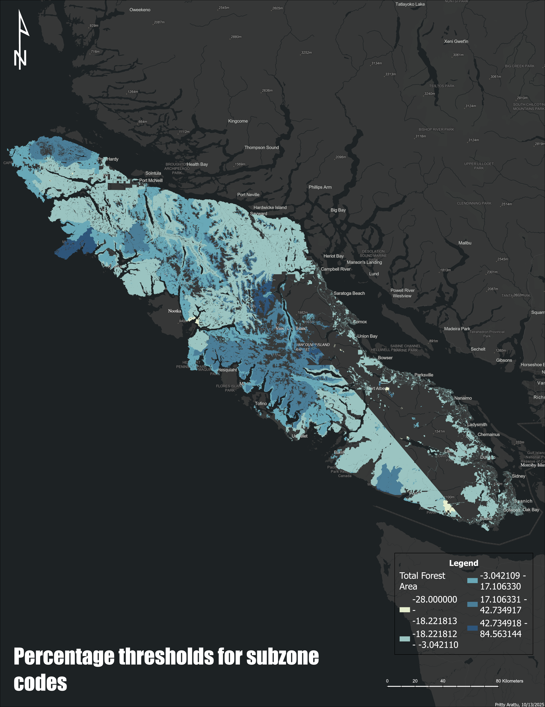
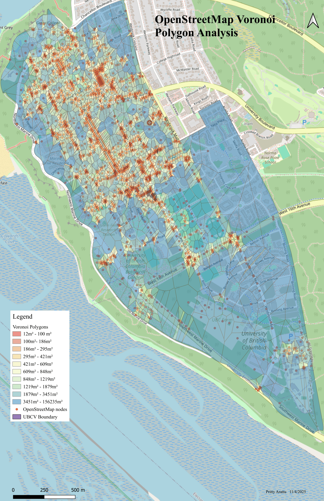

## Map Gallery {.map-gallery-title}

Click any map to view full size.

::: {.map-gallery}

{.lightbox}

**Fuel Prediction**

This map presents the predicted **fuel type classification and crown closure**
across the study area in southern British Columbia.

---

{.lightbox}

**Terrain Analysis**

This terrain analysis map highlights elevation variability and slope thresholds
within the study region.

Terrain metrics were derived from a digital elevation model and used to support
environmental modelling and spatial analysis.

---

{.lightbox}

**Least Cost Path Analysis – Grizzly Bears**

This map identifies the most efficient movement corridor between two grizzly bear habitat locations using a least-cost path model.  
Environmental resistance factors such as terrain slope, land cover, and human infrastructure were incorporated to estimate wildlife movement pathways.

---

{.lightbox}

**OpenStreetMap Cartographic Design**

This map demonstrates cartographic design using OpenStreetMap data layers.  

The project focuses on symbolization, connectivity using voronoi polygon analysis
to understand where the hotspots on UBC campus. 

---

{.lightbox}

**Riparian Buffer Analysis**

This spatial analysis evaluates riparian buffer zones surrounding stream networks.  
Buffers were generated to assess potential impacts on water quality and aquatic habitat conservation.

---

{.lightbox}

**Salmon Stream Habitat Analysis**

This map identifies potential salmon habitat along stream corridors by integrating hydrology, slope, and surrounding land cover variables.  
The analysis supports habitat conservation planning and fisheries management.

:::